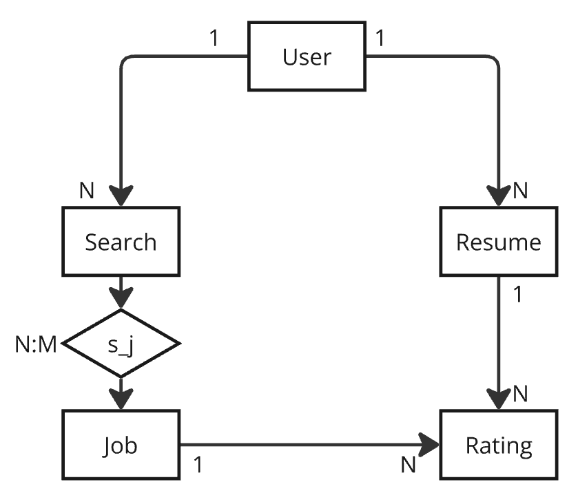

# Job Aggregator
The aim of this project is to make the workload easier on users that are searching for a job by 
taking advantage of automated AI searches.

It will scrape the most popular job boards for jobs that may interest them, store the user's information
or resume, and rate how good of a match the user is for that position, justifying the provided rating.

## TODO

- ✅ Create ``job`` table.
- ✅ Define tables.
- ✅ Create `user` table.
- ✅ Create ``search`` table.
- ✅ Create ``user_search`` table.
- ✅ Create ``search_job`` table.
- ✅ Create ``resume`` table.
- ✅ Create ``rating`` table.
- ✅ Create ``ai`` logic.
- ❌ Create ``scraper`` logic, adds to ``search``, ``job`` and ``s_j``
- ❌ Create ``processor`` logic, adds to ``rating``.

## Program Flow

### Scraping
1. Retrieves all searches with ``last_search`` older than 3 hours.
2. Scrapes the web and populates jobs, search_job by performing searches.

### Processing
1. Retrieves all the jobs, joins with search with ``last_processed`` < ``last_search`` which gives user_id, gets the user's last resume and checks if
there is a rating for that (job_id, resume_id) pair. If not it is added to the queue. 
2. Processes them, updates search ``last_processed`` and stores the result under rating.

## Entities

### `job` table:
Keeps track of all job results data.

### `user` table:
Will keep track of any user data and will be used for Auth.

### ``search`` table:
Each user may define multiple searches, which include parameters like: 
``job_source``(str|list[str]), ``search_term``(str|list[str]), ``location``, ``results_wanted``(int), ``country``, ``user_id``  
These searches will trigger every 3 hours and relate to the job results. 
They have metadata parameters: ``last_search``

### ``search_job`` N-M relational table.

### `rating` table:
Each job result will be rated by AI, keeps track of: 
`job_id`, ``resume_id``, `llm`, ``model``, ``tocken_limit``, ``system_prompt``, ``user_prompt``, ``temperature``, ``rating``, ``justification``, ``relevant_data``,  ``created_at``

### `resume` table:
Will keep track of any resumes the user has added to be processed, they may only have one active resume at a time
, it will only store the resume AFTER it has been cleaned of confidential data and has been reduced using a tokenizer, 
it will also track the active resume file if one was submitted, but this wont be used.
``user_id``, ``content``, ``date_uploaded``, ``file_url``, ``is_active``